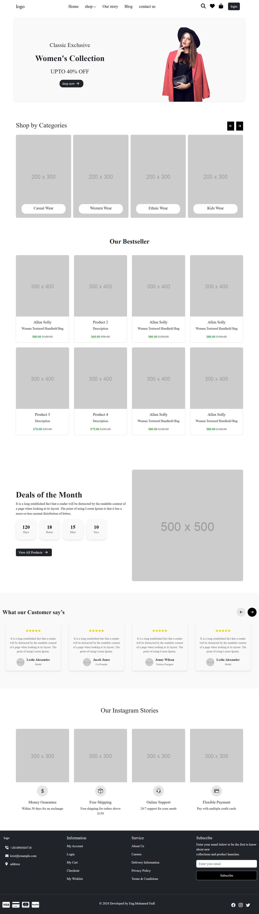

# E-Commerce Store

Welcome to the **E-Commerce Store** project! This is a fully responsive online store with user-friendly features, including browsing products, adding items to a cart, and processing orders.

## Features

- **Responsive Design**: Optimized for all devices (mobile, tablet, desktop).
- **User Authentication**: Sign up, log in, and manage your profile.
- **Product Categories**: Browse and filter products by category.
- **Cart & Checkout**: Add products to cart and complete the checkout process.
- 
## Technologies Used

- **Frontend**: HTML5, CSS3, JavaScript, Bootstrap 5

## Screenshots

Here are some screenshots of the website:

### Home Page

### Product Listing

### Cart Page

### Checkout Page

## Contributing

Contributions are welcome! Please open an issue or submit a pull request if you find any bugs or have ideas for improvements.
